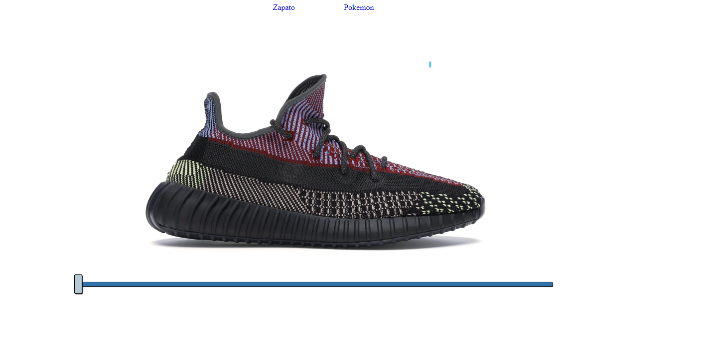
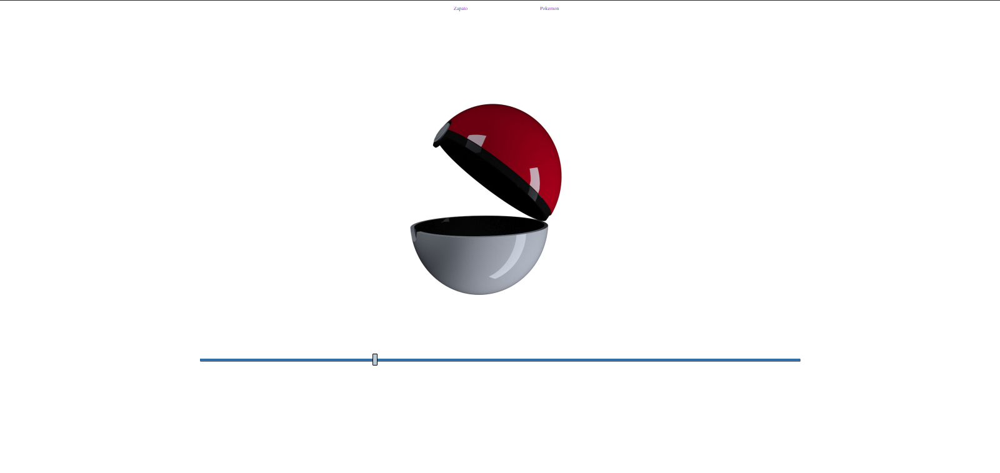

# Efecto 360 con Javascript

Ejercicio para aprender a hacer el efecto 360 de las imágenes, además de aprender a cargar imagenes con el performance correcto

### Imágenes del Proyecto

**ZAPATO 360º**

**POKEMON 360º**

### Autor

> Stalin Maza - Desarrollador Web

> Basado en el tutorial de Leonidas Esteban y patrocinado por **Platzi**